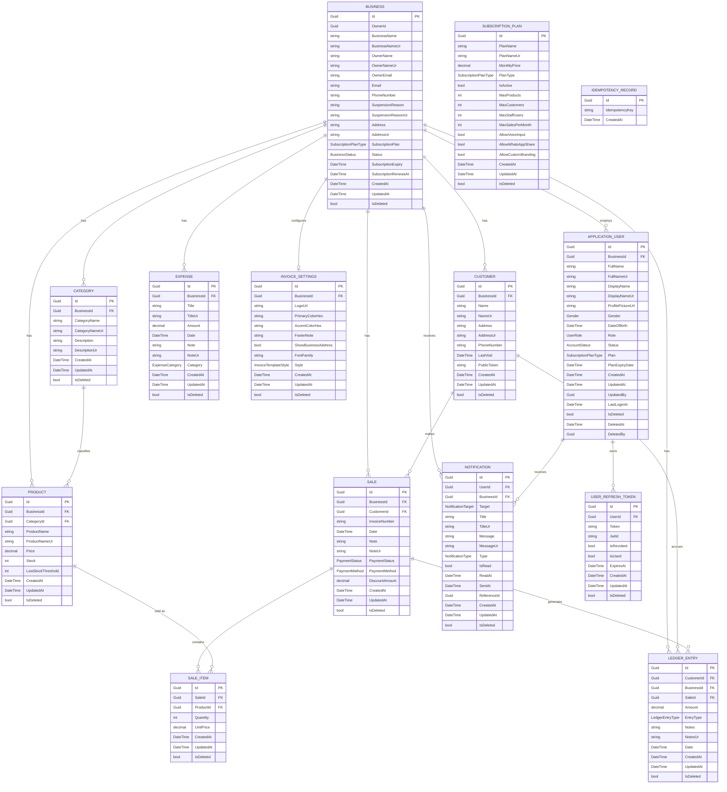

# KhataFlow

A multi-tenant SaaS platform built to help small and medium-sized businesses in Pakistan manage sales, inventory, customers, and invoicing — with offline-first support for areas with unreliable connectivity, and full bilingual (English/Urdu) support throughout.

## Overview

KhataFlow digitizes the traditional "khata" (ledger) system used by local shopkeepers and small business owners, replacing manual bookkeeping with a modern, role-based, subscription-tiered platform. Each business operates in its own isolated tenant space, with staff, sales, inventory, and reporting scoped per business — while a separate Admin Panel gives platform operators visibility and control across all tenants.

## Tech Stack

**Frontend**
- Angular 21 (standalone components, signals, `OnPush` change detection)
- Tailwind CSS with custom design tokens
- Transloco for i18n (English / Urdu)
- Dexie (IndexedDB) for offline storage
- Chart.js for analytics and reporting

**Backend**
- ASP.NET Core Web API (.NET, Clean Architecture)
- Entity Framework Core with SQL Server
- AutoMapper, FluentValidation
- SignalR for real-time notifications
- QuestPDF for invoice generation
- JWT-based authentication with role and business claims
- Gemini API & Groq API for AI-powered voice-to-transaction processing

## Roles & Access

| Role | Scope |
|---|---|
| **Super Admin** | Full platform access — all businesses, subscriptions, analytics |
| **Owner** | Full access within their own business, including Settings & Subscription |
| **Manager** | Operational access — Sales, Products, Customers, Reports (restricted from billing/settings) |
| **Staff** | Front-line access — Sales/POS, basic customer lookup |

Authorization is enforced at the controller/action level via role- and policy-based checks, not just UI hiding.

---

## Feature Specification

### Shop Owner Panel

**Dashboard**
- Monthly revenue, today's sales, total products, low-stock alerts
- Weekly sales chart (bar/line)
- Top products by sales, recent sales
- Quick actions: add product, add sale, add customer, new invoice

**Sales / POS**
- Today's sales, pending udhar, cart total
- New sale: browse/search products by category, set quantity, add to cart
- **Voice-based sale creation** — powered by Groq (fast transcription) and Gemini (structured data extraction from natural speech)
- Sales history with filters (date, status: paid/udhar/pending)
- Delete sale; view, print, and download invoice
- In-cart: select customer, apply discount, complete sale

**Products**
- List view: name, category, price, stock, status, actions (edit/delete)
- Add new product, export to CSV
- Filter by category and status

**Customers**
- List view: name, phone, total purchases, outstanding balance, last visit, actions
- Add customer, export to CSV
- Full udhar record view; filter by status (pending/cleared)
- Sort by name, highest udhar, lowest udhar
- Search customers
- **Add udhar or record payment by voice** — same Groq + Gemini voice pipeline as Sales
- Send ledger to customer via WhatsApp

**Expenses**
- Total expenses summary
- List view: title, category, note, date, amount, delete action
- **Add expense manually or by voice**
- Search, filter by category, export to CSV

**Reports**
- Filter by date range
- Export to PDF or Excel
- Summary: total revenue, gross profit, total orders, expenses, outstanding, total customers
- Revenue trend chart, top-selling products

**Settings**
- View/edit business info and profile
- Language toggle (English / Urdu)
- Subscribe to premium plan
- In-app notifications

### Admin Panel

**Dashboard**
- Total customers, active subscriptions, new signups this week, platform revenue
- User growth chart, plan distribution chart

**Users & Businesses**
- Search/filter by plan and status, export to CSV
- List view: business name, owner email, phone, plan, status, days since joined
- Actions: upgrade plan, suspend account

**Subscriptions**
- Filter by status, export to CSV
- List view: business name, plan, expiry date, days remaining, amount, status
- Actions: renew, change plan

**Platform Analytics**
- Platform revenue, new businesses, new users, ARPU
- Growth charts: revenue, users, businesses
- Revenue by plan chart
- Top-performing businesses, recent activity feed

**System Settings**
- Edit admin profile/info
- Notifications received by admin

---

## Architecture Highlights

- **Clean Architecture** on the backend — clear separation between Core (domain), Infrastructure (data access, external services), and WebAPI (presentation)
- **Soft deletes & auditing** — all entities inherit a shared `BaseEntity` (Id, CreatedAt, UpdatedAt, IsDeleted), with extended audit trails (DeletedAt, DeletedBy) on sensitive entities like `ApplicationUser`
- **Consistent API responses** — all endpoints return a standardized `ApiResponse<T>` wrapper; business-rule failures (e.g. insufficient stock) return HTTP 200 with `result: false` rather than an error status
- **Plan-gated actions** — feature/usage limits enforced via `IPlanLimitService` before write operations (max products, staff, sales/month, branding, voice input, WhatsApp sharing)
- **Offline sync strategy** — client-generated GUIDs, capped retries, and a post-reconnect settle delay to minimize duplicate-sale risk
- **Real-time notifications** — SignalR-backed low-stock/out-of-stock alerts via a fire-and-forget `TryNotifyAsync` pattern
- **Bilingual by design** — most user-facing entities carry parallel English/Urdu fields (e.g. `BusinessName` / `BusinessNameUr`) rather than a translation layer bolted on afterward
- **Idempotent writes** — dedicated `IdempotencyRecord` entity supports safe retry of sales/mutations from offline or flaky-network clients
- **AI-assisted voice input** — sales, expenses, and udhar entries can be created by voice, using Groq for fast transcription and Gemini for structured extraction of transaction data from natural speech

## Entity Relationship Diagram



## Project Structure

```
khataflow/
├── backend/
│   └── KhataFlow.WebAPI.Solution/
│       ├── KhataFlow.Core/            # Domain entities, interfaces
│       ├── KhataFlow.Infrastructure/  # EF Core, repositories, external services
│       └── KhataFlow.WebAPI/          # Controllers, extensions, API startup
└── frontend/
    └── khataflow/
        └── src/app/
            ├── components/            # Feature components (products, sales, reports, settings)
            ├── core/                  # Interceptors, guards, root singletons
            ├── services/              # API service classes
            └── shared/                # Reusable UI (toast system, pipes, directives)
```

## Getting Started

### Prerequisites
- .NET SDK
- Node.js + npm
- SQL Server (local or remote instance)
- Gemini API key and Groq API key (for voice-to-transaction)

### Backend
```bash
cd backend/KhataFlow.WebAPI.Solution
dotnet restore
dotnet ef database update
dotnet run --project KhataFlow.WebAPI
```

### Frontend
```bash
cd frontend/khataflow
npm install
ng serve
```

The frontend runs on `http://localhost:4200` by default and expects the API at the URL configured in `src/environments/environment.ts`.

## Configuration

Sensitive configuration (connection strings, JWT signing keys, Safepay API keys, Gemini API key, Groq API key) is kept out of source control.

- **Backend**: `appsettings.json` → override locally via `appsettings.Development.json` (gitignored) or user secrets
- **Frontend**: `src/environments/environment.ts` / `environment.prod.ts`

## Roadmap

- [ ] Role/policy matrix hardening (controller-level authorization per role)
- [ ] Invoice editing (update existing sale line items with server-authoritative repricing)
- [ ] Custom invoice branding (colors, logo, footer per business)
- [ ] Admin Panel: Platform Analytics & Subscriptions modules
- [ ] Reports module (PDF/Excel export)
- [ ] Full PWA support

---

## Contact

For any questions, feedback, or collaboration opportunities, reach out at [shahzaibjillani8@gmail.com](mailto:shahzaibjillani8@gmail.com)

* 📧 Email: [shahzaibjillani8@gmail.com](mailto:shahzaibjillani8@gmail.com)
* 🐙 GitHub: [github.com/shahzaibjillani1](https://github.com/shahzaibjillani1)
* 💼 LinkedIn: [linkedin.com/in/shahzaib-jillani-338352375](https://www.linkedin.com/in/shahzaib-jillani-338352375)

---

## License

Proprietary — all rights reserved.
